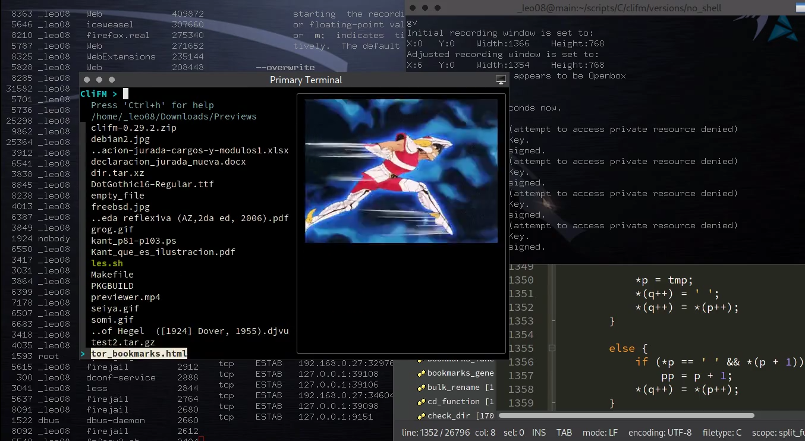
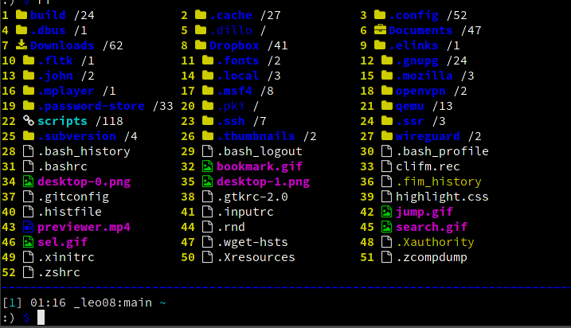
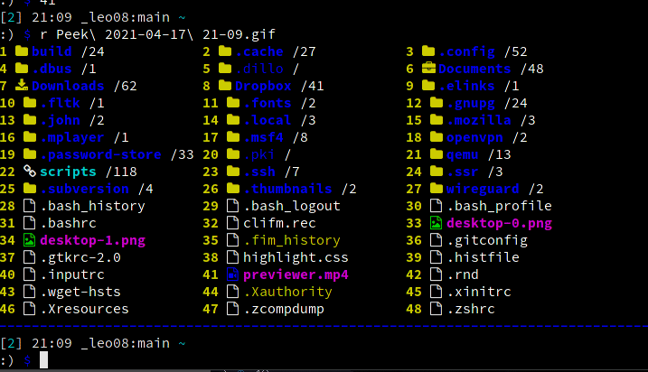
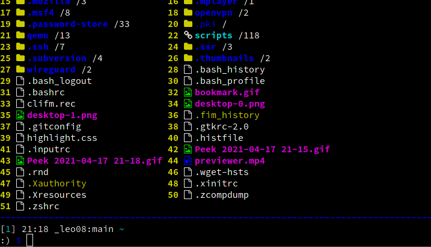
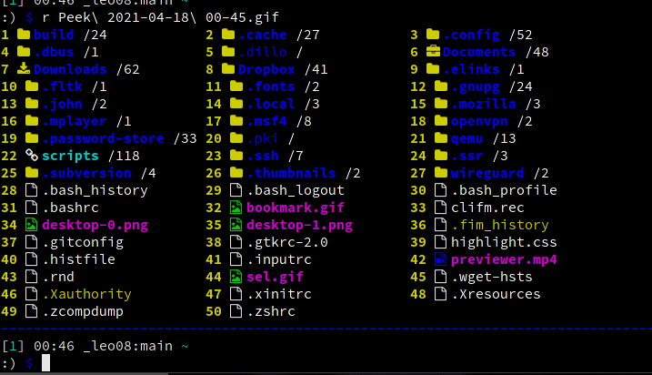
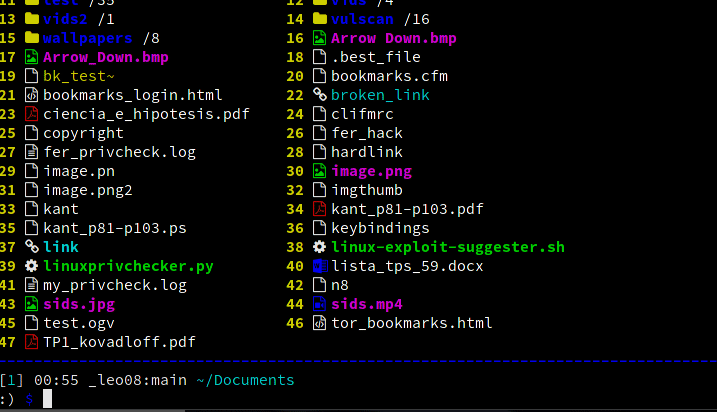
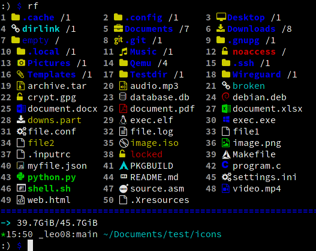
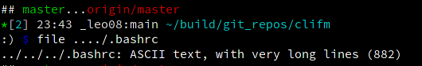
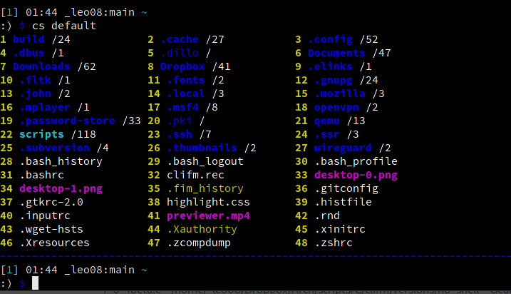

<h3 align="center">The KISS file manager: CLI-based, ultra-lightweight, lightning fast, and written in C</h3>

###

<h3 align="center"> <i>Did I say it's fast?</i></h3>

## Rationale

Why in this world do we need another file manager? In the first place, just because I can do it, write it, and learn (a lot) in the process, just because this is a free world, and very specially, a free community; and, needless to say, alternatives are at the heart of freedom.

Secondly, because I'm sure I'm not the only person in this world looking for a non-bloated, [KISS](https://wiki.archlinux.org/index.php/Arch_Linux#Simplicity) file manager: it just does whatever needs to be done using as little resources as possible. No GUI, no curses, but just a command line, shell-like file manager: 5MiB of RAM and 400KiB of disk space (plus some willingness to try something different and new) is all you need.

Finally, because CliFM, unlike most file managers out there, is certainly a file manager, but also **a shell extension**. Almost everything you do on your shell can be done in this file manager as well: search for files, copy, rename, and trash some of them, but, at the same time, update/upgrade your system, add some cronjob, stop a service, and run nano (or vi, or emacs, if you like).

## Description

CliFM is a completely command-line-based, shell-like file manager able to perform all the basic operations you may expect from any other FM. Besides these common operations, such as copy, move, remove, etc, CliFM most distinctive features are:

- [x] It is REALLY **CLI-based**. No GUI nor TUI or curses at all, just a command line. Since it does not need any GUI, it can run on the Linux built-in console and even on a SSH or any other remote session.

- [x] With a memory footprint below 5 MiB and a disk usage of 0.5 MiB, it is incredibly **lightweight and fast**, and as such, able to run on really old hardware.

- [x] The use of **short (and even one-character) commands**, and list numbers (**ELN's**) for filenames. For example, instead of typing: `cp file1 file2 file3 file4 dir/`, you can do this: `c 1-4 7`. Shorter and quicker. If the auto-cd and auto-open functions are enabled, which is the default, you can change to directories or open files by just entering the corresponding ELN. So, instead of `cd 12` or `o 12` you can just enter `12`; even shorter and quicker. As a plus, ELN's can also be used with external commands. Example: `diff 1 5` or `ls -l 12 14`. If numbers are a bit tricky to you, as they are to me, you can use the TAB key to expand the ELN to the corresponding filename. So, type `r 56`, then TAB, and it becomes `r filename`.

- [x] **Bookmarks**: With CliFM bookmarks function, accessing your preferred files and/or directories could be as easy as this: `bm` (or `Alt-b`), to call the bookmarks function, and then `1` (or whatever is the number corresponding to your bookmark).

- [x] **Files selection**: the ability to select (and deselect) files from here and there, even in different instances of the program, and then operate on them as you whish via the Selection Box or the `sel` keyword. Example: `s 1 4 56 33` will send the files corresponding to these ELN's to the Selection Box. Then, by typing `sb` you can check the contents of the Selection Box. Let's suppose you want to copy a couple of files from your home directory to some distant path, say `/media/data/misc`. Instead of copying all these files individually, you just select the files and then tell the `paste` command where to copy them:
 
`s 1 2 3 6` (or `s 1-3 6`) and then `paste sel /media/data/misc`

The selection function supports wildcards, regular expressions, inverse matching, filetype filter and path specification. For example, to list all regular files in the /etc directory, except those ending with .conf, issue this command: `s !*.conf -r :/etc`, or, using a regular expression: `s !.*\.conf$ -r :/etc`.

You can also use the 'sel' keyword with external commands. Example: `s 1-4 7 10 && file sel`.

Of course, you can deselect some or all selected files whenever you want with the `desel` or `ds` command: `ds *`, or just press `Alt-d`.

 
- [x] Open files without the need to specify any program. Via `lira` (the **built-in resource opener**), if no program was specified, CliFM will open the file with the default program associated to that kind of files. To open a file may be as simple as this: `o 12`, or `o 12 &` if you want it running in the background. Of course, you can also set a custom resource opener.

- [x] **Quick search**: type `/REGEX` and CliFM will list all matches for the corresponding REGEX pattern. Example: `/.*\.png$`
 will list all the PNG files in the current directory. If you want to 
search for files in another directory, just tell the search function 
where to search: `/.*\.png$ /media/images`. And, if you want to further filter the search, you still can specify what kind of files you want. For example: `/[.-].*d$ -d /etc` will list all directories (-d) in /etc containing a dot or a slash and ending with 'd'. The quick search function also supports invert search: prepend the exclamation mark (!) to negate or reverse a given search pattern. For example: `!.*s$ -d /etc` will match all directories in /etc NOT ending with 'd', just as `!D*` will match all files in the current directory not starting with 'D'.

- [x] A Freedesktop compliant **trash system** to be able to recover deleted files.

- [x] **Extended color codes**: Just like the `ls` command, CliFM uses customizable color codes to identify file types and extensions. However, and unlike `ls`, CliFM is also able to distinguish between empty and non-empty files or directories, broken and non-broken symlinks, files and directories with or without read permission, multi-hardlink files, and more. Once in CliFM, type `colors` or `cc` to see the list of currently used color codes.

- [x] **Files counter**: It also displays the amount of files contained by listed directories or symlinks to directories.

- [x] **Directory history map**: Keep in sight previous, current, and next entries in the directory history list for easiest and fastest navigation through visited directories.

- [x] **PLUGINS via custom actions**: Use custom action names, as if they were any other command, to run programs or scripts written in any language and extend thus CliFM functionality to fit your needs. This is basically an easy way of building custom commands for CliFM.

- [x] **Stealth mode:** Leave no trace on the host system. No file is read, no file is written.

- [x] Quickly and easily navigate through the jump database (i.e. a list of visited directories) via **Kangaroo**, a built-in **directory jumper** function similar to autojump, z.lua, and zoxide.

- [x] **Batch link**: Create multiple symbolic links at once.

- [x] **Icons support** :smirk: (depends on the [icons-in-terminal](https://github.com/sebastiencs/icons-in-terminal) project)

1) [Install](https://github.com/sebastiencs/icons-in-terminal#installation) icons-in-terminal.
2) Run CliFM with the `--icons` command line option, or, once in the program, enter `icons on`.

- [x] **NEW: Fastback function**

Because file manager, but also half-shell, CliFM also provides the following features:

- [x] Unicode suppport
- [x] TAB-completion for commands, paths, ELN's, profiles, bookmarks, color schemes, and the directory jumper function
- [x] Bash-like quoting system
- [x] History function
- [x] Shell commands execution
- [x] Glob and regular expressions, including inverse matching
- [x] Aliases
- [x] Logs
- [x] Prompt and profile commands
- [x] Bash-like prompt customization
- [x] Sequential and conditional commands execution 
- [x] User profiles
- [x] Customizable keyboard shortcuts
- [x] Lira, a built-in resource opener supporting both extension and mimetype matching. **NEW**: Lira supports now regular expressions.
- [x] Mas, a built-in pager for files listing
- [x] Eleven sorting methods: name, size, atime, btime, ctime, mtime, version, extension, inode, owner, and group. It also supports reverse sorting.
- [x] Bulk rename
- [x] Archives and compression support (including Zstandard and ISO 9660)
- [x] Auto-cd and auto-open
- [x] Symlinks editor
- [x] Disk usage
- [x] CD on quit, file picker (as shell functions)
- [x] Plugins: PDF reader, image/video previews, wallpaper setter, music playlist, updates check, drag and drop, finder, jumper, clipboard, FZF navigation/file previewing (**NEW**: including support for Ranger's scope.sh file previewer script and pistol), FZF selection, interactive help, and search files by content via Ripgrep (**NEW**)
- [x] Batch links
- [x] Read and list files form standard input
- [x] Exclude certain groups of filenames via the files filter using regular expressions
- [x] Up to eight workspaces
- [x] Fused parameters for ELN's
- [x] Advcpmv support (cp and mv with a progress bar)
- [x] **NEW**: Four customizable keybindings for custom plugins
- [x] Color schemes

**NOTE:** By default, CliFM ships only one color scheme, but more are provided by [clifm-colors](https://github.com/leo-arch/clifm-colors). The package is also available in the [AUR](https://aur.archlinux.org/packages/clifm-colors-git).

Finally, all CliFM options could be handled directly via command line, by passing parameters to the program, or via plain
text configuration files, located in `$XDG_CONFIG_HOME/clifm/`.

Insofar as it is heavily inspired by the KISS principle, CliFM is fundamentally aimed to be lightweight, fast, and simple. And if you think it's not fast enough, you can always try the **light mode** to make it even faster.

## Dependencies:

`glibc` and `coreutils`, of course, but also `libcap`, `acl`, `file`, and `readline`. For Archlinux users, all these dependenciess are part of the `core` reposiroty. In Debian systems two packages must be installed before compilation: `libcap-dev` and `libreadline-dev`. In Fedora based systems you need `libcap-devel` and `readline-devel`.

Optional dependencies: `sshfs`, `curlftpfs`, and `cifs-utils` (for remote filesystems support); `atool`, `archivemount`, `genisoimage`, `p7zip`, and `cdrtools` (for archiving and compression support), and `icons-in-terminal` to enable the icons feature.

## Compiling and Running CliFM:

### Arch Linux

You'll find the corresponding packages on the AUR: the [stable](https://aur.archlinux.org/packages/clifm) and the [development](https://aur.archlinux.org/packages/clifm-git) version. 

Of course, you can also clone, build, and install the package using the PKGBUILD file:

	$ git clone https://github.com/leo-arch/clifm.git
	$ cd clifm
	$ makepkg -si

### Other Linux distributions (or FreeBSD):

1. Clone the repository

        $ git clone https://github.com/leo-arch/clifm.git
        $ cd clifm

2. You have two options here:

#### Via make

Run `make` (*this is the recommended procedure*) as follows:

	$ sudo make install

You should find the binary file in `/usr/bin`, so that you can run it as any other program:

	$ clifm

To uninstall `clifm` issue this command wherever the Makefile is located:

	$ sudo make uninstall

#### Manually via `gcc` (`tcc` and `clang` also work). 

##### On Linux:

	$ gcc -O3 -march=native -fstack-protector-strong -s -o clifm clifm.c -lcap -lreadline -lacl

To enable POSIX compliance, pass this option to the compiler: `-D_BE_POSIX.` The only two features disabled in this way are: a) files birth time, only available on Linux via **statx(2)**, which is Linux-specific, and **strverscmp(3)**, a GNU extension used to sort files by version.

##### On FreeBSD:

	$ gcc -O3 -march=native -fstack-protector-strong -s -o clifm clifm.c -lintl -lreadline

Run the binary file produced by `gcc`:

	$ ./clifm

Of course, you can copy this binary to `/usr/bin` or `/usr/local/bin`, or anywhere in your PATH, and then run the program as always:

	$ clifm

Do not forget to install the manpage as well (the full help is in here):

	$ sudo cp manpage /usr/share/man/man1/clifm.1
	$ sudo gzip /usr/share/man/man1/clifm.1

Then you can access the manpage as always: `man clifm`

Finally, copy the plugins to the local plugins directory:

	$ cp -r /usr/share/clifm/plugins $HOME/.config/clifm

## Support

CliFM is C99 and POSIX-1.2008 compliant (if compiled with the `_BE_POSIX` flag). It works on Linux and FreeBSD, on i686, x86_64, and ARM architectures.

## License
This project is licensed under the GPL version 2 (or later) license. See the LICENSE file for details.

## First steps

Try the `help` command to learn more about CliFM. Once in the CliFM prompt, type `help` or `?`. To jump into the COMMANDS section in the manpage, simply enter `cmd` or press **F2**. Press **F1** to access the full manpage and **F3** to access the keybindings help page.

Just try it and let me know. It gets better and better. I myself use it as my main, and indeed only, file manager; it couldn't be so bad, isn't it?
