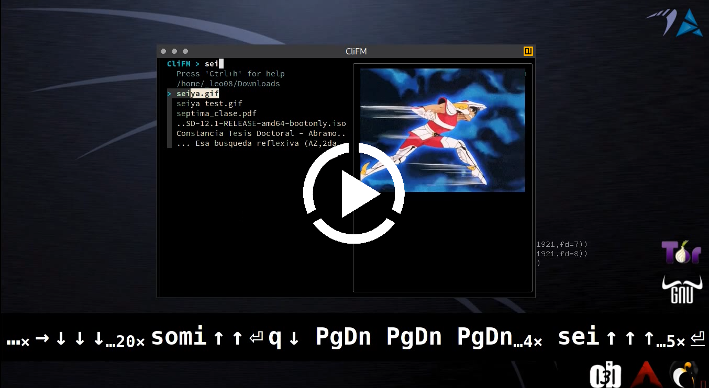
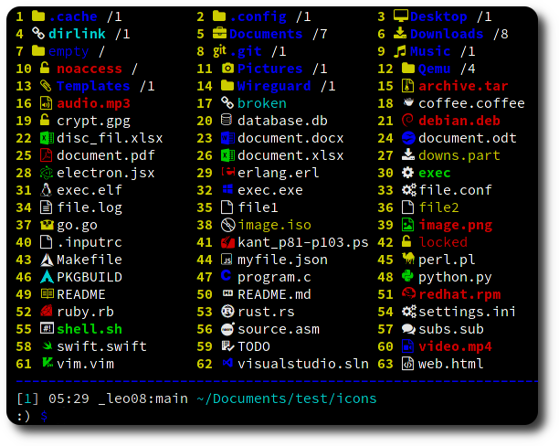

<p align="center">
	<a href="https://github.com/leo-arch/clifm">
		
	</a>
</p>
<h1 align="center">CliFM</h1>
<h2 align="center">Non-curses, KISS file-manager for the terminal</h2>
<h3 align="center">Fast, extensible, and light. Written in C.</h3>
<h4 align="center"><a
href="https://github.com/leo-arch/clifm/blob/master/.github/ISSUE_TEMPLATE/bug_report.md">Report bug</a> · <a
href="https://github.com/leo-arch/clifm/blob/master/.github/ISSUE_TEMPLATE/feature_request.md">Request feature</a> · <a
href="https://github.com/leo-arch/clifm/wiki">Browse the documentation</a></h4>

---

<p align="center">
<a href="https://aur.archlinux.org/packages/clifm/"></a>
<a href="https://aur.archlinux.org/packages/clifm/"></a>
<a href="https://aur.archlinux.org/packages/clifm/"></a>
<a href="https://en.wikipedia.org/wiki/Privacy-invasive_software"></a>
<a href="https://github.com/leo-arch/clifm/blob/master/LICENSE"></a>
<a href="https://gitter.im/leo-arch/clifm"></a>
<a></a>
</p>

<p align="right"><br><i>[…] I think I had been looking for something like this for a long time, and had never put it in words. I used [other file-managers] occasionally, but frequently just found myself doing most of my file administration from the CLI. I think this hits a nice sort of sweet spot right between the two. It feels less like a separate program and more like just putting your shell into "file-management mode".</i></p>
<p align="right"><a href="https://www.reddit.com/r/commandline/comments/nnj5vl/clifm_11_is_here_with_new_features_and_a_decent/gzwfm25/?context=3">Tuerda</a></p>
<p align="right"><br><i>Halfway between a shell and a TUI file-manager […] Nice tool, fluid, intuitive.</i></p>
<p align="right"><a href="https://www.reddit.com/r/commandline/comments/n5j36f/clifm_the_kiss_file_manager_for_the_unix_terminal/gx5nxja/?context=3">Orduval</a></p>

---

<h3 align="center"><br><i>Did I say it's fast?</i></h3>
<p align="center"><a href="https://mega.nz/embed/J8hEkCZZ#fGp0JtcDvFIWKmTc4cOp0iMrWRlbqs99THg8F7EmQWI"></a></p>

Music: "Quad Machine", by [Sonic Mayhem](https://en.wikipedia.org/wiki/Sascha_Dikiciyan)

---

## Table of contents
* [Why?](#why)
* [Description](#description)
* [Installing CliFM](#installing-clifm)
* [First steps](#first-steps)
* [Support](#support)
* [License](#license)
* [Contributing](#contributing)
* [Community](#community)

---

## Why?

Why another file manager? I can. \
In the free world, a free community finds alternatives central to freedom, and moreover, a place to learn.

Whatever needs to be done, do it in the simplest possible way: [KISS](https://en.wikipedia.org/wiki/KISS_principle) is a desired trait of a file-manager for the terminal. No GUI, no curses, but just a command-line, shell-like file manager: 5 MiB RAM and 400 KiB disk space.

Willingness to try something different is all you need.

Unlike most terminal file-managers out there, CliFM replaces the traditional curses interface by a simple command-line interface. It is a file-manager, but also **a shell extension**.

Search for files, copy, rename, and trash some of them, but, at the same time, update/upgrade your system, add some cronjob, stop a service, and run nano (or vi, or emacs, if you like).

Those familiar with the command-line will find in a file-manager based on it a desirable _addition_ to its functionality. \
The command-line is still there, never hidden.

### Should all terminal file-managers be curses-based file-managers? No.

---

## Description

<h4 align="center">CliFM's interface</h4>
<p align="center"></p>

Features beyond copy, move, remove, etc:

* [Really CLI-based](https://github.com/leo-arch/clifm/wiki/Introduction#main-design-and-goals). No GUI nor TUI or curses at all, just a command-line. Since no GUI is needed, it can run on the kernel built-in console and even on a SSH or any other remote session.
* Memory footprint below 5 MiB and a disk usage of 0.5 MiB. Incredibly lightweight and fast even on really old hardware.
* The use of [short (and even one-character) commands](https://github.com/leo-arch/clifm/wiki/Introduction#commands-short-summary), and list numbers ([ELN](https://github.com/leo-arch/clifm/wiki/Common-Operations)'s) for filenames. 
* [Bookmarks](https://github.com/leo-arch/clifm/wiki/Common-Operations#bookmarks).
* [Files selection](https://github.com/leo-arch/clifm/wiki/Common-Operations#selection) (supports both glob and regular expressions and works even across multiple instances of the program).
* [_Lira_](https://github.com/leo-arch/clifm/wiki/Specifics#resource-opener), a built-in resource opener (supports regular expressions).
* [Files search](https://github.com/leo-arch/clifm/wiki/Common-Operations#searching) (supports both glob and regular expressions).
* A built-in [Freedesktop-compliant trash system](https://github.com/leo-arch/clifm/wiki/Common-Operations#trashing-files).
* Extended [color codes](https://github.com/leo-arch/clifm/wiki/Customization#colors) for file-types and -extensions.
* [Files counter](https://github.com/leo-arch/clifm/wiki/Introduction#interface) for directories and symlinks to directories.
* Directory history map to keep in sight previous, current, and next entries in the directory history list.
* [Plugins](https://github.com/leo-arch/clifm/wiki/Advanced#plugins).
* [Files preview](https://github.com/leo-arch/clifm/wiki/Advanced#files-preview) (via _BFG_, a native file previewer, but including support for [Ranger's scope.sh](https://github.com/ranger/ranger/blob/master/ranger/data/scope.sh) and [pistol](https://github.com/doronbehar/pistol) as well).
* [Stealth mode](https://github.com/leo-arch/clifm/wiki/Advanced#stealth-mode): Leave no trace on the host system. No file is read, no file is written.
* [_Kangaroo_](https://github.com/leo-arch/clifm/wiki/Specifics#kangaroo-frecency-algorithm), a built-in directory jumper function similar to [autojump](https://github.com/wting/autojump), [z.lua](https://github.com/skywind3000/z.lua), and [zoxide](https://github.com/ajeetdsouza/zoxide).
* [Batch links](https://github.com/leo-arch/clifm/wiki/Introduction#bl-elnfile--n).
* [Icons](https://github.com/leo-arch/clifm/wiki/Advanced#icons-smirk) support :smirk:.
* Unicode suppport.
* [Tab-completion](https://github.com/leo-arch/clifm/wiki/Specifics#expansions-and-completions).
* Bash-like quoting system.
* History function.
* Shell commands execution.
* [Glob and regular expressions](https://github.com/leo-arch/clifm/wiki/Advanced#wildcards-and-regex) (including inverse matching).
* [Aliases](https://github.com/leo-arch/clifm/wiki/Customization#aliases).
* Logs.
* [Prompt and profile commands](https://github.com/leo-arch/clifm/wiki/Customization#profile-and-prompt-commands) (run commands with each new prompt or at program startup).
* Bash-like [prompt customization](https://github.com/leo-arch/clifm/wiki/Customization#the-prompt).
* Sequential and conditional commands execution .
* [User profiles](https://github.com/leo-arch/clifm/wiki/Specifics#profiles).
* Customizable [keyboard shortcuts](https://github.com/leo-arch/clifm/wiki/Customization#keybindings).
* _[Mas](https://github.com/leo-arch/clifm/wiki/Introduction#pg-pager-on-off-status)_, a built-in pager for files listing.
* [11 sorting methods](https://github.com/leo-arch/clifm/wiki/Introduction#st-sort-method-rev).
* [Bulk renaming](https://github.com/leo-arch/clifm/wiki/Advanced#bulk-rename).
* [Archiving and compression](https://github.com/leo-arch/clifm/wiki/Advanced#archives) support (including Zstandard and ISO 9660).
* [Auto-cd](https://github.com/leo-arch/clifm/wiki/Introduction#acd-autocd-on-off-status) and [auto-open](https://github.com/leo-arch/clifm/wiki/Introduction#ao-auto-open-on-off-status).
* [Symlinks editor](https://github.com/leo-arch/clifm/wiki/Introduction#c-l-e-edit-m-md-r).
* Disk usage.
* [CD on quit](https://github.com/leo-arch/clifm/wiki/Advanced#cd-on-quit) and [file picker](https://github.com/leo-arch/clifm/wiki/Advanced#file-picker) functions.
* Read and list files form [standard input](https://github.com/leo-arch/clifm/wiki/Advanced#standard-input).
* [Files filter](https://github.com/leo-arch/clifm/wiki/Advanced#file-filters).
* Up to eight [workspaces](https://github.com/leo-arch/clifm/wiki/Specifics#workspaces).
* [Fused parameters for ELN's](https://github.com/leo-arch/clifm/wiki/Introduction#fused-parameters).
* [Advanced Copy](https://github.com/jarun/advcpmv) support (just `cp` and `mv` with a nice progress bar).
* [Light mode](https://github.com/leo-arch/clifm/wiki/Specifics#speed-and-performance) (just in case it is not fast enough for you).
* [Color schemes](https://github.com/leo-arch/clifm/wiki/Customization#colors).
* Four [customizable keybindings for custom plugins](https://github.com/leo-arch/clifm/wiki/Customization#keybindings).
* [Fastback function](https://github.com/leo-arch/clifm/wiki/Introduction#fastback-function).
* [Git integration](https://github.com/leo-arch/clifm/wiki/Advanced#git-integration).

For a detailed explanation of each of these features, follow the corresponding links or consult the [wiki](https://github.com/leo-arch/clifm/wiki).

---

## Installing CliFM

### Dependencies

`glibc` and `coreutils`, of course, but also `libcap`, `acl`, `file`, and `readline`. \
For Arch Linux users, all these dependenciess are part of the `core` reposiroty. \
In Debian/Ubuntu systems three packages must be installed before compilation: `libcap-dev`, `libacl1-dev`, and `libreadline-dev`. In Fedora based systems you need `libcap-devel`, `libacl-devel`, and `readline-devel`.

Optional dependencies: `sshfs`, `curlftpfs`, and `cifs-utils` (for remote-filesystem support); `atool`, `archivemount`, `genisoimage`, `p7zip`, and `cdrtools` (for archival and compression support), and `icons-in-terminal` to turn on icons.

### Arch Linux

You'll find the corresponding packages on the AUR: the [stable](https://aur.archlinux.org/packages/clifm) and the [development](https://aur.archlinux.org/packages/clifm-git) version.

A binary package is now available in the `chaotic-aur` repository. Follow the official [installation instructions](https://aur.chaotic.cx/).

Of course, you can also clone, build, and install the package using the [PKGBUILD file](https://github.com/leo-arch/clifm/blob/master/misc/PKGBUILD):

```sh
$ git clone https://github.com/leo-arch/clifm.git
$ cd clifm/misc
$ makepkg -si
```

### Debian-based systems
A .deb package (for x86_64) is available in [Releases](https://github.com/leo-arch/clifm/releases).

### Other Linux distributions or FreeBSD:

1. Clone the repository

```sh
$ git clone https://github.com/leo-arch/clifm.git
$ cd clifm
```

2. Run `make` as follows:

```sh
$ sudo make install
```

You should find the binary file in `/usr/bin`, so that you can run it as any other program:

	$ clifm

To uninstall `clifm`, issue this command where the makefile is located:

	$ sudo make uninstall

---

## First steps

The `help` command teaches you about CliFM. \
Once in the CliFM prompt, type `help` or `?`. \
To jump into the **COMMANDS** section in the manpage, simply enter `cmd` or press <kbd>F2</kbd>. \
Press <kbd>F1</kbd> to access the full manpage and <kbd>F3</kbd> to access the keybindings help-page.

You can also take a look at some of these [basic usage-examples](https://github.com/leo-arch/clifm/wiki/Common-Operations#basic-usage-examples) to get you started.

---

## Support

CliFM is C99 and POSIX-1.2008 compliant (if compiled with the `_BE_POSIX` flag). \
It works on Linux and FreeBSD, on i686, x86_64, and ARM architectures.

---

## License
This project is licensed GPL version 2 (or later). \
See the [LICENSE](https://github.com/leo-arch/clifm/blob/master/LICENSE) file for details.

---

## Contributing
Yes. Please see our [contribution guidelines](https://github.com/leo-arch/clifm/blob/master/CONTRIBUTING.md) for details.

---

## Community
Join our [Gitter discussion room](https://gitter.im/leo-arch/clifm) and let us know what you think: ideas, comments, observations and questions are always welcome. \
The [Discussions](https://github.com/leo-arch/clifm/discussions) section of this repo is also open to input.
