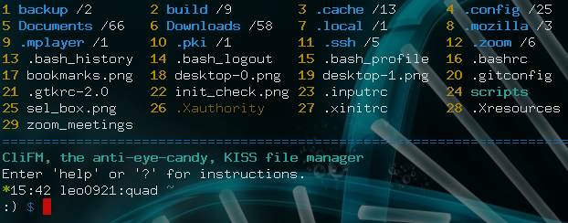
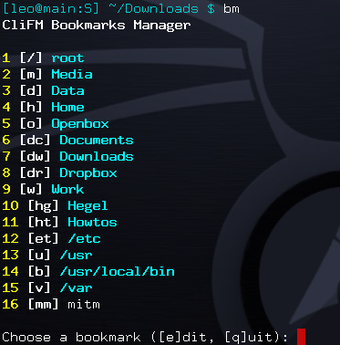
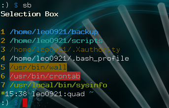
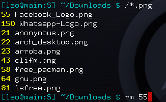
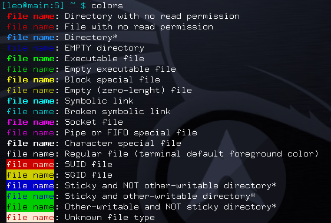

# CliFM
> The KISS file manager: CLI-based, ultra-lightweight, lightning fast, and written in C

### Packages

## Version notes

0.18.0. This is the first POSIX-2008 compliant and FreeBSD compatible version.

Version 0.17.2 is the first one to work on ARM machines.

Since version 0.16.0 a lot (really, a lot) of bug fixes and some new features were added: a trash system (freedesktop compliant), keyboard shorcuts (very handy), a little messages system to keep track of important messages and errors, "sel" keyword and ranges auto-expansion, ELN expansion with the TAB key, including a Bash-like quoting system (absolutely great), colors customization, and commands sequential and conditional execution (very useful). Consult the manpage for more information). I also added support for translations (using `gettext`).

## Rationale

Why in this world do we need another file manager? In the first place, just because I can do it, write it, and learn (a lot) in the process, just because this is a free world, and very specially, a free community; and, needless to say, alternatives are at the heart of freedom. Secondly, because I'm sure I'm not the only person in this world looking for a non-bloated, KISS file manager: it just does whatever needs to be done using as little resources as possible. No GUI, no curses, but just a command line file manager: 5MiB of RAM and 250KiB of disk space is all you need. Finally, because it is certainly a file manager, but also a shell extension. Almost everything you do on your shell can be done in this file manager as well: search for files, copy, rename, and trash some of them, but, at the same time, update/upgrade your system, add some cronjob, stop a service, and run nano (or Vi if you like).

## Description

CliFM is a completely command-line-based, shell-like file manager able to perform all the basic operations you may expect from any other FM. Besides these common operations, such as copy, move, remove, etc, CLiFM most distinctive features are:

* It is REALLY CLI-based. No GUI (like Thunar and the like) nor TUI or curses (like Ranger or nnn) at all, just a command line. Since it does not need any GUI, it can run on the Linux built-in console and even on a SSH or any other remote session.

* With a memory footprint below 5 MiB and a disk usage of 0.25 MiB, it is incredibly lightweight and fast, and as such, able to run on really old hardware. It is probabily the most lightweight and fastest file manager out there.

* The use of short (and even one-character) commands, and list numbers (ELN's) for filenames. For example, instead of typing: `cp file1 file2 file3 file4 dir/`, you can do this: `c 1-4 7`. Shorter and quicker. As a plus, ELN's can also be used with external commands. Example: `diff 1 5` or `ls -l 12 14`. If numbers are a bit tricky to you, as they are to me, you can use the TAB key to expand the ELN to the corresponding filename. So, type `r 56`, then TAB, and it becomes `r filename`.

* Bookmarks: With CLiFM bookmarks function, accessing your preferred files and/or directories be as easy as this: `bm` (or `Alt-b`), to call the bookmarks function, and then `1` (or whatever is the number corresponding to your bookmark).

* Files selection: the ability to select (and deselect) files from here and there, even in different instances of the program, and then operate on them as you whish via the Selection Box or the `sel` keyword. Example: `s 1 4 56 33` will send the files corresponding to these ELN's to the Selection Box. Then, by typing `sb` you can check the contents of the Selection Box. Let's suppose you want to copy a couple of files from your home directory to some distant path, say `/media/data/misc`. Instead of copying all these files individually, you just select the files and then tell the `paste` command where to copy them:
 
`s 1 2 3 6` (or `s 1-3 6`) and then `paste sel /media/data/misc`

You can also use the 'sel' keyword with external commands. Example: `s 1-4 7 10 && file sel`.

Of course, you can deselect some or all selected files whenever you want with the `desel` or `ds` command: `ds *`, or just press `Alt-d`.

 
 * Open files without the need to specify any program. Via `mime` (the built-in resource opener), if no program was specified, CliFM will open the file with the default program associated to that kind of files. To open a file may be as simple as this: `o 12`, or `o 12 &` if you want it running in the background. Of course, you can also set a custom resource opener.

* Quick search: type `/string` and CliFM will list all the files containing `string` in its name. This function also supports wildcards. Example: `/*.png` will list all the .png files in the current directory. If you want to search for files in another directory, just tell the search function where to search: `/*.png /media/images`.

* A `trash system` to be able to recover deleted files.

* Just like the `ls` command, CLiFM uses (customizable) color codes to identify file types. However, and unlike `ls`, CLiFM is also able to distinguish between empty and non-empty files or directories, broken and non-broken symlinks, files and directories with or without read permission, and more. Once in CliFM, type `colors` to see the list of currently used color codes.

* It also displays the amount of files contained by listed directories or symlinks to directories.

Because file manager, but also half-shell, CLiFM als provides the following features:

* TAB-completion for commands, paths, and ELN's
* Bash-like quoting system
* History function
* Shell commands execution 
* Aliases
* Logs
* Prompt and profile commands
* Bash-like prompt customization
* Sequential and conditional commands execution 
* User profiles
* Keyboard shortcuts
* Resource opener
* Multiple sorting methods: name, size, atime, btime, ctime, mtime, and version. Also supports reverse sorting.
* Bulk rename
* Archives and compression support (including Zstandard)

Finally, all CLiFM options could be handled directly via command line, by passing parameters to the program, or via plain
text configuration files, located in `~/.config/clifm/`.

Insofar as it is heavily inspired by Arch Linux and its KISS principle, CLiFM is fundamentally aimed to be lightweight, fast, and simple. And if you think it's not fast enough, you can always try the **light mode** to make it even faster.

On Arch's notion of simplcity see: https://wiki.archlinux.org/index.php/Arch_Linux#Simplicity

## Dependencies:

`glibc`, `ncurses`, `libcap`, `readline`, `coreutils` (providing basic programs such as rm, cp, mkdir, etc). For archers: All these dependenciess are part of the `core` repo, and `glibc` is also part of the `base` metapackage. In Debian systems two packages must be installed before compilation: `libcap-dev` and `libreadline-dev`. In Fedora based systems you need `libcap-devel` and `readline-devel`. Optional dependencies: `file`, `atool`, and `archivemount`.

## Compiling and Running CliFM:

### Arch Linux

You'll find the corresponding packages on the AUR: https://aur.archlinux.org/packages/clifm and, for the development version, https://aur.archlinux.org/packages/clifm-git. 

Of course, you can also clone, build, and install the package using the PKGBUILD file:

	$ git clone https://github.com/leo-arch/clifm.git
	$ cd clifm
	$ makepkg -si

### Some other distribution (or FreeBSD):

1. Clone the repository

        $ git clone https://github.com/leo-arch/clifm.git
        $ cd clifm

2. You have two options here:

#### Via make

Run `make` (*this is the recommended procedure*) as follows:

	$ make build && sudo make install

You should find the binary file in `/usr/bin`, so that you can run it as any other program:

	$ clifm

To uninstall `clifm` issue this command wherever the Makefile is located:

	$ sudo make uninstall

#### Manually via `gcc` (`tcc` and `clang` also work). 

##### On Linux:

	$ gcc -O3 -march=native -fstack-protector-strong -s -o clifm clifm.c -lcap -lreadline -lacl

To enable POSIX compliance, pass this option to the compiler: `-D_BE_POSIX.` The only feature disabled in this way is files birth time, only available on Linux via statx(), which is Linux-specific and thereby not POSIX compliant.

##### On FreeBSD:

	$ gcc -O3 -march=native -fstack-protector-strong -s -o clifm clifm.c -lintl -lreadline

Run the binary file produced by `gcc`:

	$ ./clifm

Of course, you can copy this binary to `/usr/bin` or `/usr/local/bin`, or anywhere in your PATH, and then run the program as always:

	$ clifm

Do not forget to install the manpage as well (the full help is in here):

	$ sudo cp manpage /usr/share/man/man1/clifm.1
	$ sudo gzip /usr/share/man/man1/clifm.1

Then you can access the manpage as always: `man clifm`

## First steps

Try `help` command to learn more about CliFM. Once in the CliFM prompt, type `help` or `?`:

	12:12 user:hostname /etc
	:) $ help

To jumtp into the COMMANDS section in the manpage, simply enter `cmd`.

Just try it and let me know. It gets better and better. I myself use it as my main, and indeed only, file manager; it couldn't be so bad, isn't it?
