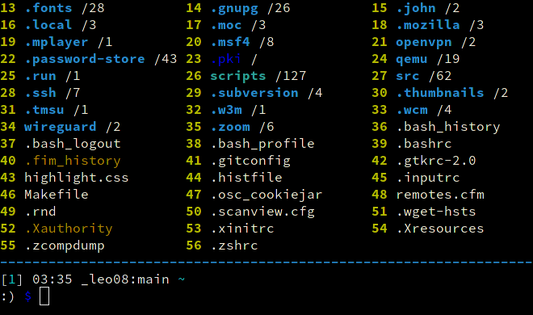

	

<h1 align="center">CliFM</h1>
<h2 align="center">Non-curses, KISS file manager for the terminal</h2>
<h3 align="center">Fast, extensible, lightweight | Written in C</h3>
<h3 align="center">Linux, FreeBSD, NetBSD, OpenBSD, Haiku | x86, ARM</h3>
<h4 align="center"><a
href="https://github.com/leo-arch/clifm/blob/master/.github/ISSUE_TEMPLATE/bug_report.md">Report bug</a> · <a
href="https://github.com/leo-arch/clifm/blob/master/.github/ISSUE_TEMPLATE/feature_request.md">Request feature</a> · <a
href="https://github.com/leo-arch/clifm/wiki">Browse the documentation</a> · <a
href="https://software.opensuse.org//download.html?project=home%3Aarchcrack&package=clifm">Downloads</a></h4>

---

<!---

-->

 <i>[…] I think I had been looking for something like this for a long time, and had never put it in words. I used [other file-managers] occasionally, but frequently just found myself doing most of my file administration from the CLI. I think this hits a nice sort of sweet spot right between the two. It feels less like a separate program and more like just putting your shell into "file-management mode".</i>

<a href="https://www.reddit.com/r/commandline/comments/nnj5vl/clifm_11_is_here_with_new_features_and_a_decent/gzwfm25/?context=3">Tuerda</a>

 <i>Halfway between a shell and a TUI file manager […] Nice tool, fluid, intuitive.</i>

<a href="https://www.reddit.com/r/commandline/comments/n5j36f/clifm_the_kiss_file_manager_for_the_unix_terminal/gx5nxja/?context=3">Orduval</a>

---

<h3 align="center"> <i>Did I say it's fast?</i></h3>

Music: "Quad Machine", by [Sonic Mayhem](https://en.wikipedia.org/wiki/Sascha_Dikiciyan) \
**Note**: Icons and files preview depend on third-party software. Consult the [icons](https://github.com/leo-arch/clifm/wiki/Advanced#icons-smirk) and [files preview](https://github.com/leo-arch/clifm/wiki/Advanced#files-preview) sections.

---

## Table of contents
*   [Why?](#why)
*   [Description](#description)
*   [Installing CliFM](#installing-clifm)
*   [First steps](#first-steps)
*   [Support](#support)
*   [License](#license)
*   [Contributing](#contributing)
*   [Community](#community)

---

## Why\?

Why another file manager? I can. \
In a free world, a free community finds alternatives central to freedom, and moreover, a place to learn.

Whatever needs to be done, do it in the simplest possible way: [KISS](https://en.wikipedia.org/wiki/KISS_principle) is a desired trait of a file manager for the terminal. No GUI, no TUI, but just a shell-like, **C**ommand **L**ine **I**nterface **F**ile **M**anager.

Unlike most terminal file managers out there, CliFM replaces the traditional TUI interface (also known as curses or text-menu based interface) by a simple command-line interface.1 It is a file manager, but also **a shell extension**.

Search for files, copy, rename, and trash some of them, but, at the same time, update/upgrade your system, add some cronjob, stop a service, and run nano (or vi, or emacs, if you like).

Those familiar with the command-line will find in a file manager based on it a desirable _addition_ to its functionality. \
The command-line is still there, never hidden.

Besides 5 MiB RAM and 500 KiB disk space, willingness to try something different is all you need.

### Should all terminal file managers be TUI file managers? No\.

---
_1_ <i>For a detailed explanation and comparison between these concepts see the [resources page](https://github.com/leo-arch/clifm/wiki/Resources#gui-tui-and-cli) and the [introductory page](https://github.com/leo-arch/clifm/wiki/Introduction#what-is-clifm) of the Wiki</i>.

---

## Description

<h4 align="center">CliFM's interface</h4>

Features beyond common file operations, such as copy, move, remove, etc.:

*   [Really CLI-based](https://github.com/leo-arch/clifm/wiki/Introduction#main-design-and-goals). No GUI nor TUI (or curses) at all, just a command-line. It can run thereby on the kernel built-in console and even on a SSH or any other remote session.
*  Memory footprint below 5 MiB and a disk usage of 500 KiB. Incredibly lightweight and fast even on really old hardware. See the [performance section](https://github.com/leo-arch/clifm/wiki/Performance).
*   The use of [short (and even one-character) commands](https://github.com/leo-arch/clifm/wiki/Introduction#commands-short-summary), and [entry list numbers (ELN's)](https://github.com/leo-arch/clifm/wiki/Common-Operations) for file names. 
*   [Bookmarks](https://github.com/leo-arch/clifm/wiki/Common-Operations#bookmarks).
*   [Files selection](https://github.com/leo-arch/clifm/wiki/Common-Operations#selection) (supports both glob and regular expressions and works even across multiple instances of the program).
*   [_Lira_, a built-in resource opener](https://github.com/leo-arch/clifm/wiki/Specifics#resource-opener) (supports regular expressions and is able to discern between GUI and non-GUI environments).
*   [Files search](https://github.com/leo-arch/clifm/wiki/Common-Operations#searching) (supports both glob and regular expressions).
*   [A built-in Freedesktop-compliant trash system](https://github.com/leo-arch/clifm/wiki/Common-Operations#trashing-files).
*   [Extended color codes](https://github.com/leo-arch/clifm/wiki/Customization#colors) for file-types and -extensions.
*   [Files counter](https://github.com/leo-arch/clifm/wiki/Introduction#interface) for directories and symlinks to directories.
*   Directory history map to keep in sight previous, current, and next entries in the directory history list.
*   [Plugins](https://github.com/leo-arch/clifm/wiki/Advanced#plugins).
*  [Files preview](https://github.com/leo-arch/clifm/wiki/Advanced#files-preview) (via _BFG_, a native file previewer, but including support for [Ranger's scope.sh](https://github.com/ranger/ranger/blob/master/ranger/data/scope.sh) and [pistol](https://github.com/doronbehar/pistol) as well).
*   [Stealth mode](https://github.com/leo-arch/clifm/wiki/Advanced#stealth-mode): Leave no trace on the host system. No file is read, no file is written.
*   [_Kangaroo_](https://github.com/leo-arch/clifm/wiki/Specifics#kangaroos-frecency-algorithm), a built-in directory jumper function similar to [autojump](https://github.com/wting/autojump), [z.lua](https://github.com/skywind3000/z.lua), and [zoxide](https://github.com/ajeetdsouza/zoxide).
*   [Batch links](https://github.com/leo-arch/clifm/wiki/Introduction#bl-elnfile--n).
*   [Icons support](https://github.com/leo-arch/clifm/wiki/Advanced#icons-smirk) :smirk:.
* Unicode suppport.
*   [Tab-completion](https://github.com/leo-arch/clifm/wiki/Specifics#expansions-completions-and-suggestions).
*   Bash-like quoting system.
*   [Directory](https://github.com/leo-arch/clifm/wiki/Introduction#b-back-h-hist-clear-eln) and [commands](https://github.com/leo-arch/clifm/wiki/Introduction/#commands-history) history.
*   Shell commands execution.
*   [Glob and regular expressions](https://github.com/leo-arch/clifm/wiki/Advanced#wildcards-and-regex) (including inverse matching).
*   [Aliases](https://github.com/leo-arch/clifm/wiki/Customization#aliases).
*   [Logs](https://github.com/leo-arch/clifm/wiki/Introduction#log-clear-on-off-status).
*   [Prompt and profile commands](https://github.com/leo-arch/clifm/wiki/Customization#profile-and-prompt-commands) (run commands with each new prompt or at program startup).
*   [Bash-like prompt customization](https://github.com/leo-arch/clifm/wiki/Customization#the-prompt).
*  Sequential and conditional commands execution .
*   [User profiles](https://github.com/leo-arch/clifm/wiki/Specifics#profiles).
*   [Customizable keyboard shortcuts](https://github.com/leo-arch/clifm/wiki/Customization#keybindings).
*   [_Mas_, a built-in pager](https://github.com/leo-arch/clifm/wiki/Introduction#pg-pager-on-off-status) for files listing.
*   [Eleven sorting methods](https://github.com/leo-arch/clifm/wiki/Introduction#st-sort-method-rev).
*   [Bulk renaming](https://github.com/leo-arch/clifm/wiki/Advanced#bulk-rename).
*   [Archiving and compression](https://github.com/leo-arch/clifm/wiki/Advanced#archives) support (including Zstandard and ISO 9660).
*   [Auto-cd](https://github.com/leo-arch/clifm/wiki/Introduction#acd-autocd-on-off-status) and [auto-open](https://github.com/leo-arch/clifm/wiki/Introduction#ao-auto-open-on-off-status).
*   [Symlinks editor](https://github.com/leo-arch/clifm/wiki/Introduction#c-l-e-edit-m-md-r).
*   Disk usage.
*   [CD on quit](https://github.com/leo-arch/clifm/wiki/Advanced#cd-on-quit) and [file picker](https://github.com/leo-arch/clifm/wiki/Advanced#file-picker) functions.
*   Read and list files from [STDIN (standard input)](https://github.com/leo-arch/clifm/wiki/Advanced#standard-input).
*   [Files filter](https://github.com/leo-arch/clifm/wiki/Advanced#files-filters).
*   [Up to eight workspaces](https://github.com/leo-arch/clifm/wiki/Specifics#workspaces).
*   [Fused parameters for ELN's](https://github.com/leo-arch/clifm/wiki/Introduction#fused-parameters).
*   [Advanced Copy](https://github.com/jarun/advcpmv) support (just `cp` and `mv` with a nice progress bar).
*   [Light mode](https://github.com/leo-arch/clifm/wiki/Specifics#speed-and-performance) (just in case it is not fast enough for you).
*   [Color schemes](https://github.com/leo-arch/clifm/wiki/Customization#colors).
*   [Four customizable keybindings for custom plugins](https://github.com/leo-arch/clifm/wiki/Customization#keybindings).
*   [Fastback function](https://github.com/leo-arch/clifm/wiki/Introduction#fastback-function).
*   [Git integration](https://github.com/leo-arch/clifm/wiki/Advanced#git-integration).
*   [Remote file systems management](https://github.com/leo-arch/clifm/wiki/Introduction#net-name-edit-m-mount-name-u-unmount-name).
*   [Compile features in/out](https://github.com/leo-arch/clifm/blob/master/src/README.md#compiling-features-inout).
*   _[Gemini](https://github.com/leo-arch/clifm/wiki/Specifics#auto-suggestions)_, a Fish-like auto-suggestions system.

<h4 align="center"> <i>Gemini in action</i></h4>

</a>

---
For a detailed explanation of each of these features, follow the corresponding links or consult the [wiki](https://github.com/leo-arch/clifm/wiki). \
To enjoy of any of the features tagged as NEW, clone this repository and install the program via the Makefile. Follow the instructions below.

---

## Installing CliFM

Consult the [installation page](https://github.com/leo-arch/clifm/wiki/Introduction#installation).

---

## First steps

The `help` command teaches you about CliFM. \
Once in the CliFM prompt, type `help` or `?`. \
To jump into the **COMMANDS** section in the manpage, simply enter `cmd` or press <kbd>F2</kbd>. \
Press <kbd>F1</kbd> to access the full manpage and <kbd>F3</kbd> to access the keybindings help-page.

You can also take a look at some of these [basic usage-examples](https://github.com/leo-arch/clifm/wiki/Common-Operations#basic-usage-examples) to get you started.

---

## Support

CliFM is C99 and POSIX-1.2008 compliant (if compiled with the `_BE_POSIX` flag). Consult the [compilation page](https://github.com/leo-arch/clifm/blob/master/src/README.md#4-compilation).\
It works on Linux, FreeBSD, NetBSD, OpenBSD, and Haiku, on x86 and ARM architectures.

---

## License
This project is licensed GPL version 2 (or later). \
See the [LICENSE file](https://github.com/leo-arch/clifm/blob/master/LICENSE) for details.

---

## Contributing
Yes. Please see our [contribution guidelines](https://github.com/leo-arch/clifm/blob/master/CONTRIBUTING.md) for details.
 at Hosted Weblate.

---

## Community
Join our [Gitter discussion room](https://gitter.im/leo-arch/clifm) and let us know what you think: ideas, comments, observations and questions are always welcome. \
The [Discussions section](https://github.com/leo-arch/clifm/discussions) of this repo is also open to input.
