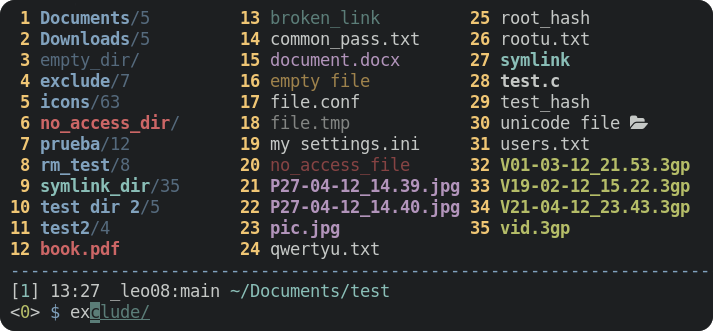

	

<h1 align="center">CliFM</h1>
<h2 align="center">The Command Line File Manager</h2>
<h3 align="center">Fast, extensible, lightweight | Written in C</h3>
<h3 align="center">Linux, FreeBSD, NetBSD, OpenBSD, Haiku | x86, ARM</h3>
<h4 align="center"><a
href="https://software.opensuse.org//download.html?project=home%3Aarchcrack&package=clifm">Downloads</a> · <a
href="https://github.com/leo-arch/clifm/wiki">Browse the documentation</a> · <a
href="https://github.com/leo-arch/clifm/blob/master/.github/ISSUE_TEMPLATE/feature-request.md">Request feature</a> · <a
href="https://github.com/leo-arch/clifm/blob/master/.github/ISSUE_TEMPLATE/bug-report.md">Report bug</a></h4>

---

<!---

-->

<!---

-->

---

## Table of contents
*   [Description](#description)
*   [Features](#features)
*   [Installing _CliFM_](#installing-clifm)
*   [First steps](#first-steps)
*   [Support](#support)
*   [License](#license)
*   [Contributing](#contributing)
*   [Community](#community)

---

## Description

_CliFM_ is a **C**ommand **L**ine **I**nterface **F**ile **M**anager: all input and interaction is performed via commands. This is its main feature and strength.

Unlike most terminal file managers out there, indeed, _CliFM_ replaces the traditional TUI interface (also known as curses or text-menu based interface) by a command-line interface.1

If working with the command-line, your workflow is not affected at all, but just enriched with file management functionalities: automatic files listing, files selection, bookmarks, directory jumper, directory history, auto-cd and auto-open, bulk rename, and a trash system, among [other features](#features). In this sense, _CliFM_ is certainly a file manager, but also a shell extension.

Briefly put, with _CliFM_ the command-line is always already there, never hidden.

---
1 <i>For a detailed explanation consult the [introductory section](https://github.com/leo-arch/clifm/wiki/Introduction#what-is-clifm) of the Wiki. For more information about these concepts (CLI and TUI) see the [resources page](https://github.com/leo-arch/clifm/wiki/Resources#gui-tui-and-cli) </i>.

---

<h4 align="center">CliFM's interface</h4>

Watch me fly!

<h3 align="center"> <i>Did I say it's fast?</i></h3>

Music: "Quad Machine", by [Sonic Mayhem](https://en.wikipedia.org/wiki/Sascha_Dikiciyan) \
**Note**: Icons and files preview depend on third-party software. Consult the [icons](https://github.com/leo-arch/clifm/wiki/Advanced#icons-smirk) and [files preview](https://github.com/leo-arch/clifm/wiki/Advanced#files-preview) sections.

## Features

Click here to expand

Besides common file operations such as copy, move, remove, etc., _CliFM_ provides the following features:
- Specific
  - [Really CLI-based](https://github.com/leo-arch/clifm/wiki/Introduction#main-design-and-goals). No GUI nor TUI (or curses) at all, just a command-line. 
  - It can run on the kernel built-in console and even on a SSH or any other remote session.
  - Highly compatible with old VT102-only terminal emulators (8-colors only and no Unicode support) like Rxvt and Rxvt-based ones. 
  - [High performance](https://github.com/leo-arch/clifm/wiki/Performance). With a memory footprint below 5 MiB and a disk usage of less than 1 MiB it is incredibly lightweight and fast even on really old hardware.
  - [Short (and even one-character) commands](https://github.com/leo-arch/clifm/wiki/Introduction#commands-short-summary), and [entry list numbers (ELN's)](https://github.com/leo-arch/clifm/wiki/Common-Operations) for file names. 
  - [Extended color codes](https://github.com/leo-arch/clifm/wiki/Customization#colors) for file-types and -extensions.
  - [Files counter](https://github.com/leo-arch/clifm/wiki/Introduction#interface) for directories and symlinks to directories.
- Navigation and file operations
  - [Bookmarks](https://github.com/leo-arch/clifm/wiki/Common-Operations#bookmarks).
  - [Files selection](https://github.com/leo-arch/clifm/wiki/Common-Operations#selection) (supports both glob and regular expressions and works even across multiple instances of the program).
  - [Files search](https://github.com/leo-arch/clifm/wiki/Common-Operations#searching) (supports both glob and regular expressions).
  - [copy(-as), move(-as)](https://github.com/leo-arch/clifm/wiki/Introduction#c-l-e-edit-m-md-r), [interactive rename](https://github.com/leo-arch/clifm/wiki/Introduction#c-l-e-edit-m-md-r), and [open-with](https://github.com/leo-arch/clifm/wiki/Introduction#ow-elnfilename-application) functions.
  - [_Bleach_, a built-in file names cleaner](https://github.com/leo-arch/clifm/wiki/Introduction#bb-bleach-elnfile--n)
  - [Autocommands](https://github.com/leo-arch/clifm/wiki/Specifics#autocommands)
  - [Auto-cd](https://github.com/leo-arch/clifm/wiki/Introduction#acd-autocd-on-off-status), [auto-open](https://github.com/leo-arch/clifm/wiki/Introduction#ao-auto-open-on-off-status), and [autols](https://github.com/leo-arch/clifm/wiki/Common-Operations#navigation).
  - [_Kangaroo_](https://github.com/leo-arch/clifm/wiki/Specifics#kangaroos-frecency-algorithm), a built-in directory jumper function similar to [autojump](https://github.com/wting/autojump), [z.lua](https://github.com/skywind3000/z.lua), and [zoxide](https://github.com/ajeetdsouza/zoxide).
  - [Fastback function](https://github.com/leo-arch/clifm/wiki/Introduction#fastback-function).
  - [_Lira_, a built-in resource opener](https://github.com/leo-arch/clifm/wiki/Specifics#resource-opener) (supports regular expressions and is able to discern between GUI and non-GUI environments).
  - [A built-in Freedesktop-compliant trash system](https://github.com/leo-arch/clifm/wiki/Common-Operations#trashing-files).
  - [Files filter](https://github.com/leo-arch/clifm/wiki/Advanced#files-filters).
  - [Up to eight workspaces](https://github.com/leo-arch/clifm/wiki/Specifics#workspaces).
  - [Eleven sorting methods](https://github.com/leo-arch/clifm/wiki/Introduction#st-sort-method-rev).
  - [Bulk rename](https://github.com/leo-arch/clifm/wiki/Advanced#bulk-rename).
  - [Batch links](https://github.com/leo-arch/clifm/wiki/Introduction#bl-elnfile--n).
  - [Archiving and compression](https://github.com/leo-arch/clifm/wiki/Advanced#archives) support (including Zstandard and ISO 9660).
  - [Symlinks editor](https://github.com/leo-arch/clifm/wiki/Introduction#c-l-e-edit-m-md-r).
  - Directory history map to keep in sight previous, current, and next entries in the directory history list.
- Shell
  - _[Gemini](https://github.com/leo-arch/clifm/wiki/Specifics#auto-suggestions)_, a Fish-like auto-suggestions system.
  - [TAB completion](https://github.com/leo-arch/clifm/wiki/Specifics#expansions-completions-and-suggestions).
  - [FZF mode for TAB completion](https://github.com/leo-arch/clifm/wiki/Specifics#tab-completion)
  - [Syntax highlighting](https://github.com/leo-arch/clifm/wiki/Specifics#syntax-highlighting)
  - [Warning prompt for invalid command names](https://github.com/leo-arch/clifm/wiki/Specifics/#the-warning-prompt)
  - [Fused parameters for ELN's](https://github.com/leo-arch/clifm/wiki/Introduction#fused-parameters).
  - Bash-like quoting system.
  - Shell commands execution.
  - Sequential and conditional commands execution .
  - [Directory](https://github.com/leo-arch/clifm/wiki/Introduction#b-back-h-hist-clear-eln) and [commands](https://github.com/leo-arch/clifm/wiki/Introduction/#commands-history) history.
  - [Glob and regular expressions](https://github.com/leo-arch/clifm/wiki/Advanced#wildcards-and-regex) (including inverse matching).
  - [Aliases](https://github.com/leo-arch/clifm/wiki/Customization#aliases).
  - [Logs](https://github.com/leo-arch/clifm/wiki/Introduction#log-clear-on-off-status).
  - [Prompt and profile commands](https://github.com/leo-arch/clifm/wiki/Customization#profile-and-prompt-commands) (run commands with each new prompt or at program startup).
- 3 Modes
  - Normal
  - [Stealth mode](https://github.com/leo-arch/clifm/wiki/Specifics#stealth-mode): Leave no trace on the host system. No file is read, no file is written.
  - [Light mode](https://github.com/leo-arch/clifm/wiki/Specifics#light-mode) (just in case it is not fast enough for you).
- Customization
  - [User profiles](https://github.com/leo-arch/clifm/wiki/Specifics#profiles).
  - [Customizable keyboard shortcuts](https://github.com/leo-arch/clifm/wiki/Customization#keybindings).
  - [Color schemes](https://github.com/leo-arch/clifm/wiki/Customization#colors).
  - [Bash-like prompt customization](https://github.com/leo-arch/clifm/wiki/Customization#the-prompt).
  - [Four customizable keybindings for custom plugins](https://github.com/leo-arch/clifm/wiki/Customization#keybindings).
  - [Compile features in/out](https://github.com/leo-arch/clifm/blob/master/src/README.md#compiling-features-inout).
- Misc
  - [Plugins](https://github.com/leo-arch/clifm/wiki/Advanced#plugins).
  - [Files preview](https://github.com/leo-arch/clifm/wiki/Advanced#files-preview) (via _BFG_, a native file previewer, but including support for [Ranger's scope.sh](https://github.com/ranger/ranger/blob/master/ranger/data/scope.sh) and [pistol](https://github.com/doronbehar/pistol) as well).
  - [Icons support](https://github.com/leo-arch/clifm/wiki/Advanced#icons-smirk) :smirk:.
  - [Git integration](https://github.com/leo-arch/clifm/wiki/Advanced#git-integration).
  - [Remote file systems management](https://github.com/leo-arch/clifm/wiki/Introduction#net-name-edit-m-mount-name-u-unmount-name).
  - [Easily mount/unmount storage devices](https://github.com/leo-arch/clifm/wiki/Introduction#media)
  - Unicode suppport.
  - Disk usage.
  - [CD on quit](https://github.com/leo-arch/clifm/wiki/Advanced#cd-on-quit) and [file picker](https://github.com/leo-arch/clifm/wiki/Advanced#file-picker) functions.
  - [Advanced Copy](https://github.com/jarun/advcpmv) support (just `cp` and `mv` with a nice progress bar).
  - [_Mas_, a built-in pager](https://github.com/leo-arch/clifm/wiki/Introduction#pg-pager-on-off-status) for files listing.
  - Read and list files from [STDIN (standard input)](https://github.com/leo-arch/clifm/wiki/Advanced#standard-input).

<h4 align="center"> <i>Gemini in action</i></h4>

</a>

---
For a detailed explanation of each of these features, follow the corresponding links or consult the [Wiki](https://github.com/leo-arch/clifm/wiki).

**NEW**: [Backdir - Quickly change to a parent directory](https://github.com/leo-arch/clifm/wiki/Introduction#bd-name)

**NEW**: [Multi-selection for FZF TAB completion](https://github.com/leo-arch/clifm/wiki/Specifics#expansions-completions-and-suggestions)

**NEW**: [Secure environment](https://github.com/leo-arch/clifm/wiki/Specifics#security)

**NEW**: [Secure commands](https://github.com/leo-arch/clifm/wiki/Specifics#security)

---

## Installing _CliFM_

Consult the [installation page](https://github.com/leo-arch/clifm/wiki/Introduction#installation).

---

## First steps

To sart using _CliFM_ **you don't need to learn anything new**: the usual shell commands will just work. However, there is much more that just shell commands... \
The `help` command teaches you about most of _CliFM_ commands: once in the _CliFM_ prompt, type `help` or `?`. \
To jump into the **COMMANDS** section in the manpage, simply enter `cmd` or press <kbd>F2</kbd>. \
Press <kbd>F1</kbd> to access the full manpage and <kbd>F3</kbd> to access the keybindings help-page.

You can also take a look at some of these [basic usage-examples](https://github.com/leo-arch/clifm/wiki/Common-Operations#basic-usage-examples) to get you started.

---

## Support

_CliFM_ is C99 and POSIX-1.2008 compliant (if compiled with the `_BE_POSIX` flag). Consult the [compilation page](https://github.com/leo-arch/clifm/blob/master/src/README.md#5-compilation).\
It works on Linux, FreeBSD, NetBSD, OpenBSD, and Haiku, on x86 and ARM architectures.

---

## License
This project is licensed GPL version 2 (or later). \
See the [LICENSE file](https://github.com/leo-arch/clifm/blob/master/LICENSE) for details.

---

## Contributing
Yes. Please see our [contribution guidelines](https://github.com/leo-arch/clifm/blob/master/CONTRIBUTING.md) for details.
 at Hosted Weblate.

---

## Community
Join our [Gitter discussion room](https://gitter.im/leo-arch/clifm) and let us know what you think: ideas, comments, observations and questions are always welcome. \
The [Discussions section](https://github.com/leo-arch/clifm/discussions) of this repo is also open to input.
